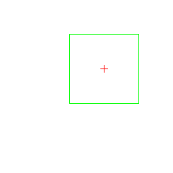

# Disclaimer
In this project I wanted to showcase some image drawing.


# References
- https://en.wikipedia.org/wiki/Cartesian_coordinate_system
- https://martin-thoma.com/how-to-check-if-a-point-is-inside-a-rectangle/

# The core of it
```

func checkPoint() bool {
	rect := Rect{
		AX: bottomLeftx,
		AY: bottomLefty,
		BX: bottomLeftx,
		BY: bottomLefty + height,
		CX: bottomLeftx + width,
		CY: bottomLefty + height,
		DX: bottomLeftx + width,
		DY: bottomLefty,
	}

	point := Point{
		X: x,
		Y: y,
	}

	// Calculate the area of the original rectangle
	rectArea := 0.5 * math.Abs(((rect.AY-rect.CY)*(rect.DX-rect.BX))+((rect.BY-rect.DY)*(rect.AX-rect.CX)))
	// Calculate a rectangle area using our new point
	ABP := 0.5 * math.Abs((rect.AX*(rect.BY-point.Y) + rect.BX*(point.Y-rect.AY) + point.X*(rect.AY-rect.BY)))
	BCP := 0.5 * math.Abs((rect.BX*(rect.CY-point.Y) + rect.CX*(point.Y-rect.BY) + point.X*(rect.BY-rect.CY)))
	CDP := 0.5 * math.Abs((rect.CX*(rect.DY-point.Y) + rect.DX*(point.Y-rect.CY) + point.X*(rect.CY-rect.DY)))
	DAP := 0.5 * math.Abs((rect.DX*(rect.AY-point.Y) + rect.AX*(point.Y-rect.DY) + point.X*(rect.DY-rect.AY)))

	return rectArea == (ABP + BCP + CDP + DAP)

}

```

# Installation
- go get github.com/zkynet/rectdist

# Usage
- go run main.go checkpoint --rect-bottom-left-x 0 --rect-bottom-left-y 0 --rect-height 100 --rect-width 100 --point-x 50 --point-y 50

# Results
- a message indicating if the point is inside or outside of the rectangle
- an image showing the rectangle and where the point is

# Rendered image
   

